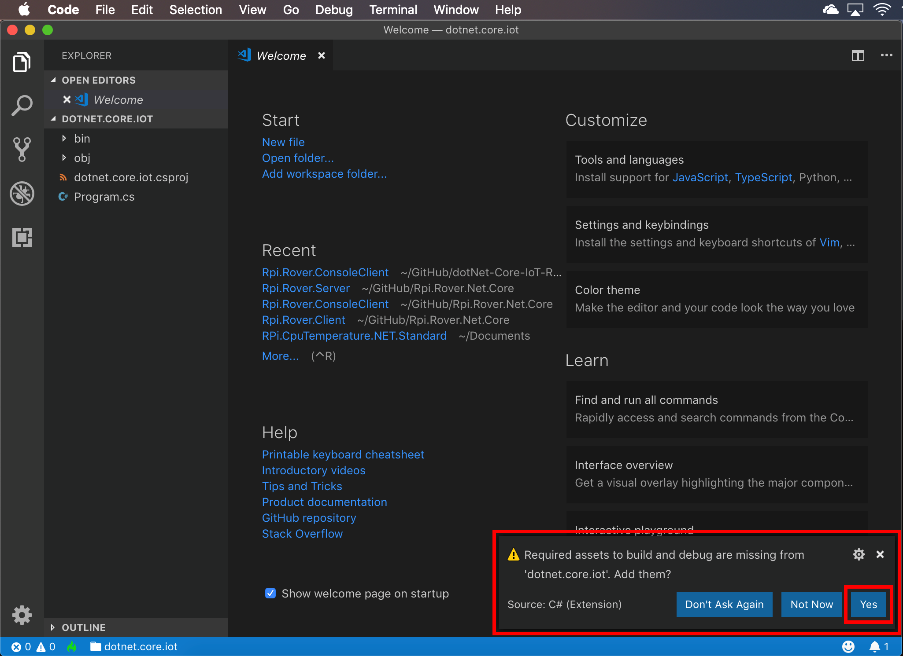
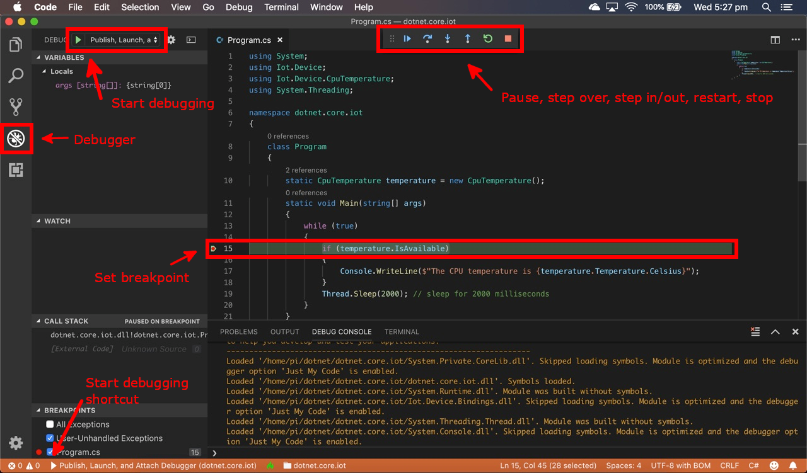

# .NET Core IoT, Raspberry Pi Linux, and Azure IoT Hub. Learn how to Build, Deploy and Debug


 Follow me on [Twitter](https://twitter.com/dglover).

## Source Code

The source and the samples for this walk-through can be found [here](https://github.com/gloveboxes/dotNET-Core-IoT-Raspberry-Pi-Linux.-How-to-Build-Deploy-and-Debug).

## Introduction

The .NET Core IoT Library connects your applications to hardware. In this walk-through you will learn how to:

1. Develop a C# .NET Core IoT application from a Linux, macOS or Windows 10 desktop,
2. Deploy the app to a Raspberry Pi running Linux (or another Linux board such as the BeagleBone Black),
3. Debug and step through your code,
4. Stream telemetry to [Azure IoT Hub](https://docs.microsoft.com/en-us/azure/iot-hub/about-iot-hub?WT.mc_id=github-blog-dglover),
5. And if you are a glutton for punishment then check out the [F# .Net Core IoT] in the [samples](https://github.com/gloveboxes/dotNET-Core-IoT-Raspberry-Pi-Linux.-How-to-Build-Deploy-and-Debug) folder.

## Why .NET Core

It used by millions of developers, it is mature, fast, supports multiple programming languages (C#, F#, and VB.NET), runs on multiple platforms (Linux, macOS, and Windows), and is supported across multiple processor architectures. It is used to build device, cloud, and IoT applications.

[.NET Core](https://docs.microsoft.com/en-au/dotnet/core?WT.mc_id=github-blog-dglover) is an [open-source](https://github.com/dotnet/coreclr/blob/master/LICENSE.TXT), general-purpose development platform maintained by Microsoft and the .NET community on [GitHub](https://github.com/dotnet/core).

## The .NET Core IoT Libraries Open Source Project

The Microsoft .NET Core team along with the developer community are building support for [IoT](https://en.wikipedia.org/wiki/Internet_of_things) scenarios. The [.NET Core IoT Library](https://github.com/dotnet/iot) is supported on Linux, and Windows IoT Core, across ARM and Intel processor architectures. See the [.NET Core IoT Library Roadmap](https://github.com/dotnet/iot/blob/master/Documentation/roadmap.md) for more information.

### System.Device.Gpio

The [System.Device.Gpio](https://www.nuget.org/packages/System.Device.Gpio)  package supports general-purpose I/O ([GPIO](https://en.wikipedia.org/wiki/General-purpose_input/output)) pins, PWM, I2C, SPI and related interfaces for interacting with low-level hardware pins to control hardware sensors, displays and input devices on single-board-computers; [Raspberry Pi](https://www.raspberrypi.org/), [BeagleBoard](https://beagleboard.org/), [HummingBoard](https://www.solid-run.com/nxp-family/hummingboard/), [ODROID](https://www.hardkernel.com/), and other single-board-computers that are supported by Linux and Windows 10 IoT Core.

### Iot.Device.Bindings

The [.NET Core IoT Repository](https://github.com/dotnet/iot/tree/master/src) contains [IoT.Device.Bindings](https://www.nuget.org/packages/Iot.Device.Bindings), a growing set of community-maintained device bindings for IoT components that you can use with your .NET Core applications. If you can't find what you need then porting your own C/C++ driver libraries to .NET Core and C# is pretty straight forward too.

The drivers in the repository include sample code along with wiring diagrams. For example the [BMx280 - Digital Pressure Sensors BMP280/BME280](https://github.com/dotnet/iot/tree/master/src/devices/Bmx280).


## Software Set Up for Linux, macOS, and Windows 10 Desktops

You can create .NET Core IoT projects on Linux, macOS and Windows desktops.  You need to install the following software.

1. [.NET Core](https://dotnet.microsoft.com/download?WT.mc_id=github-blog-dglover)
2. [Visual Studio Code](https://code.visualstudio.com?WT.mc_id=github-blog-dglover)

### Additional Windows 10 Software Requirements

1. [Windows Subsystem for Linux (WSL)](https://docs.microsoft.com/en-us/windows/wsl/install-win10?WT.mc_id=github-blog-dglover). I suggest you install the Ubuntu 18.04 distribution.
2. [PuTTY SSH and telnet client](https://www.putty.org/)
3. The [WSL workspaceFolder](https://marketplace.visualstudio.com/itemdetails?itemName=lfurzewaddock.vscode-wsl-workspacefolder) Visual Studio Extension

## Setting up your Raspberry Pi

.Net Core requires an AMR32v7 processor and above, so anything Raspberry Pi 2 or better and you are good to go. Note, Raspberry Pi Zero is an ARM32v6 processor, and not supported.

If you've not set up a Raspberry Pi before then this is a great guide. "[HEADLESS RASPBERRY PI 3 B+ SSH WIFI SETUP (MAC + WINDOWS)](https://desertbot.io/blog/headless-raspberry-pi-3-bplus-ssh-wifi-setup)". The Instructions outlined for macOS will work on Linux.

**This walk-through assumes the default Raspberry Pi network name, 'raspberrypi.local', and the default password, 'raspberry'.**


## Configure Connection to your Raspberry Pi

The following creates a new SSH key, copies the public key to the Raspberry Pi, and then installs the Visual Studio Debugger on the Raspberry Pi. Take the default options.

### From Linux and macOS

Open a new Terminal, and copy and paste the following command.

```bash
ssh-keygen -t rsa && ssh-copy-id pi@raspberrypi.local && \
ssh pi@raspberry.local "curl -sSL https://aka.ms/getvsdbgsh | bash /dev/stdin -r linux-arm -v latest -l ~/vsdbg"
```

### From Windows 10

Press the Windows Key
, type 'cmd', then press the Enter key to open the Windows command prompt. Then copy and paste the following commands.

```bash
ping raspberrypi.local
```

Replace xxx.xxx.xxx.xxx with the IP Address of the Raspberry Pi and then copy and paste the following command into the Windows Command prompt.

```bash
bash -c "ssh-keygen -t rsa && ssh-copy-id pi@xxx.xxx.xxx.xxx" && ^
plink -ssh -pw raspberry pi@raspberrypi.local "curl -sSL https://aka.ms/getvsdbgsh | bash /dev/stdin -r linux-arm -v latest -l ~/vsdbg"
```

## Creating your first .NET Core IoT project

Open a command prompt or terminal window, and paste in the following command(s). It will create the project directory, create the .NET Core Console app, add the Iot.Device.Bindings package, and then launch Visual Studio Code.

```bash
mkdir dotnet.core.iot.csharp && cd dotnet.core.iot.csharp

dotnet new console --langVersion=latest && dotnet add package Iot.Device.Bindings --version 0.1.0-prerelease*

code .
```

1. Add the Visual Studio Code Build and Debug assets



2. Replace the code in program.cs file with the following code. This code will read the Raspberry Pi CPU Temperature and display it in the system console window.

```c#
using System;
using Iot.Device.CpuTemperature;
using System.Threading;

namespace dotnet.core.iot
{
    class Program
    {
        static CpuTemperature temperature = new CpuTemperature();
        static void Main(string[] args)
        {
            while (true)
            {
                if (temperature.IsAvailable)
                {
                    Console.WriteLine($"The CPU temperature is {temperature.Temperature.Celsius}");
                }
                Thread.Sleep(2000); // sleep for 2000 milliseconds, 2 seconds
            }
        }
    }
}
```

Your Visual Studio Code **program.cs** file should look like the following screenshot.


## Deploying the project to your Raspberry Pi

To deploy a project to your Raspberry Pi you need to configure Visual Studio Code to compile for **linux-arm**, how to copy the compiled code to the Raspberry Pi, and finally how to attach the debugger.

For this walk-through, we are going to use [rsync](https://en.wikipedia.org/wiki/Rsync) to copy program files to the Raspberry Pi. Rsync is a very efficient file transfer protocol, comes standard with Linux, macOS, and Windows with the [Windows Subsystem for Linux (WSL)](https://docs.microsoft.com/en-us/windows/wsl/install-win10?WT.mc_id=github-blog-dglover) installed.

## Updating the Visual Studio Code Build Files

We need to update the [launch.json](https://code.visualstudio.com/docs/editor/debugging) and [tasks.json](https://code.visualstudio.com/docs/editor/debugging) files with the following code.


**This walk-through assumes the default Raspberry Pi network name, 'raspberrypi.local', and the default password, 'raspberry'.**

### launch.json

The launch.json file calls a **publish** prelaunch task which builds and copies the program to the Raspberry Pi, it then starts the program on the Raspberry Pi and attaches the debugger.

```json
{
    "version": "0.2.0",
    "configurations": [
        {
            "name": "Raspberry Pi Publish, Launch, and Attach Debugger",
            "type": "coreclr",
            "request": "launch",
            "preLaunchTask": "RaspberryPublish",
            "program": "~/${workspaceFolderBasename}/${workspaceFolderBasename}",
            "cwd": "~/${workspaceFolderBasename}",
            "stopAtEntry": false,
            "console": "internalConsole",
            "args": [
                "https://your-dmx-function.azurewebsites.net/api"
            ],
            "pipeTransport": {
                "pipeCwd": "${workspaceRoot}",
                "pipeProgram": "/usr/bin/ssh",
                "pipeArgs": [
                    "pi@raspberrypi.local"
                ],
                "debuggerPath": "~/vsdbg/vsdbg"
            },
            "windows": {
                "pipeTransport": {
                    "pipeCwd": "${workspaceRoot}",
                    "pipeProgram": "plink",
                    "pipeArgs": [
                        "-ssh",
                        "-pw",
                        "raspberry",
                        "pi@raspberrypi.local"
                    ],
                    "debuggerPath": "~/vsdbg/vsdbg"
                }
            }
        }
    ]
}
```

### tasks.json

The tasks.json file defines how to compile the project for linux-arm and how to copy the program to the Raspberry Pi with rsync. On **Windows**, you must explicitly specify the **IP Address** of the Raspberry Pi as rsync is called via Bash and the Windows Subsystem for Linux does not resolve .local DNS names.

```json
{
    "version": "2.0.0",
    "tasks": [
        {
            "label": "RaspberryPublish",
            "command": "sh",
            "type": "shell",
            "problemMatcher": "$msCompile",
            "args": [
                "-c",
                "\"dotnet publish -r linux-arm -o bin/linux-arm/publish",
                "${workspaceFolder}/${workspaceFolderBasename}.csproj\"",
                ";",
                "sh",
                "-c",
                "\"rsync -rvuz ${workspaceFolder}/bin/linux-arm/publish/ pi@raspberrypi.local:~/${workspaceFolderBasename}\""
            ],
            "windows": {
                "command": "cmd",
                "args": [
                    "/c",
                    "\"dotnet publish -r linux-arm -o bin\\linux-arm\\publish",
                    "${workspaceFolder}\\${workspaceFolderBasename}.csproj\"",
                    "&&",
                    "bash",
                    "-c",
                    "\"rsync -rvuz $(wslpath '${workspaceFolder}')/bin/linux-arm/publish/ pi@raspberrypi.local:~/${workspaceFolderBasename}\""
                ]
            }
        }
    ]
}
```

## Build, Deploy and Debug your .NET Core IoT App

Review this [Visual Studio Debugger Guide](https://code.visualstudio.com/docs/editor/debugging) if you've not used the debugger before.

Set a breakpoint in your code, for example at the 15, and from Visual Studio Code click the Debug icon on the Activity bar, ensure "**Publish, Launch and Attach Debugger**" is selected in the dropdown, and click the green run icon.

Your code will build, it will be copied to your Raspberry Pi and the debugger will be attached and you can now start stepping through your code.



## Connect your Raspberry Pi to Azure IoT Hub

1. Follow the "[Create an Azure IoT Hub (Free)](https://docs.microsoft.com/en-us/azure/iot-hub/quickstart-send-telemetry-dotnet?WT.mc_id=github-blog-dglover)" tutorial until the "Send simulated telemetry" section. You will need to the connection string of the device you created.

2. Add the Package references for Azure IoT Hub and JSON.NET. This can either be done by executing the 'dotnet add package' command, or by updating the references directly in the .csproj file.

Open the dotnet.core.iot.csharp.csproj file and update the <ItemGroup> section as follows.

```xml
<ItemGroup>
    <PackageReference Include="Iot.Device.Bindings" Version="0.1.0-prerelease*" />
    <PackageReference Include="Microsoft.Azure.Devices.Client" Version="1.*" />
    <PackageReference Include="Newtonsoft.Json" Version="12.0.1" />  
</ItemGroup>
```

3. Replace the code in program.cs file with the following code and add your device connection string.

This code will read the Raspberry Pi CPU Temperature, display it, then send the telemetry to Azure IoT Hub.

```c#
using System;
using Iot.Device.CpuTemperature;
using Newtonsoft.Json;
using Microsoft.Azure.Devices.Client;
using System.Text;
using System.Threading;
using System.Threading.Tasks;

namespace dotnet.core.iot
{
    class Program
    {
        const string DeviceConnectionString = "<Your Azure IoT Hub Connection String>";

        // Replace with the device id you used when you created the device in Azure IoT Hub
        const string DeviceId = "<Your Device Id>";
        static DeviceClient _deviceClient = DeviceClient.CreateFromConnectionString(DeviceConnectionString, TransportType.Mqtt);
        static CpuTemperature _temperature = new CpuTemperature();
        static int _msgId = 0;
        const double TemperatureThreshold = 42.0;

        static async Task Main(string[] args)
        {
            while (true)
            {
                if (_temperature.IsAvailable)
                {
                    Console.WriteLine($"The CPU temperature is {Math.Round(_temperature.Temperature.Celsius, 2)}");
                    await SendMsgIotHub(_temperature.Temperature.Celsius);
                }
                Thread.Sleep(2000); // sleep for 2000 milliseconds
            }
        }

        private static async Task SendMsgIotHub(double temperature)
        {
            var telemetry = new Telemetry() { Temperature = Math.Round(temperature, 2), MessageId = _msgId++ };
            string json = JsonConvert.SerializeObject(telemetry);

            Console.WriteLine($"Sending {json}");

            Message eventMessage = new Message(Encoding.UTF8.GetBytes(json));
            eventMessage.Properties.Add("temperatureAlert", (temperature > TemperatureThreshold) ? "true" : "false");
            await _deviceClient.SendEventAsync(eventMessage).ConfigureAwait(false);
        }

        class Telemetry
        {
            [JsonPropertyAttribute (PropertyName="temperature")] 
            public double Temperature { get; set; } = 0;

            [JsonPropertyAttribute (PropertyName="messageId")] 
            public int MessageId { get; set; } = 0;

            [JsonPropertyAttribute (PropertyName="deviceId")] 
            public string DeviceId {get; set;} = Program.DeviceId;
        }
    }
}
```

## Redeploy the App to the Raspberry Pi

Press F5 to run the current 'Publish, Launch, and Attach Debugger' build task.

## Monitor the Azure IoT Hub Telemetry

1. Install the [Visual Studio IoT Hub Toolkit](https://marketplace.visualstudio.com/itemdetails?itemName=vsciot-vscode.azure-iot-toolkit).

2. Review the [Visual Studio IoT Hub Toolkit](https://github.com/Microsoft/vscode-azure-iot-toolkit/wiki)] Wiki for information on using the IoT Hub Toolkit Visual Studio Extension.

## References

[Remote Debugging On Linux Arm](https://github.com/OmniSharp/omnisharp-vscode/wiki/Remote-Debugging-On-Linux-Arm)

[Azure IoT libraries for .NET](https://docs.microsoft.com/en-au/dotnet/api/overview/azure/iot?view=azure-dotnet&WT.mc_id=hackster-blog-dglover)

## Quick Notes

Using the new built in Windows OpenSSH client. Windows 10 1809+

Install OpenSSH Client on Windows (one time only operation).

From PowerShell as Administrator

```bash
Add-WindowsCapability -Online -Name OpenSSH.Client
```

Close PowerShell and reopen as **non administrator** user.


```bash
ssh-keygen -t rsa ; `
cat ~/.ssh/id_rsa.pub | ssh user@123.45.56.78 "mkdir ~/.ssh; cat >> ~/.ssh/authorized_keys"
```

References

- [Is there an equivalent to ssh-copy-id for Windows?](https://serverfault.com/questions/224810/is-there-an-equivalent-to-ssh-copy-id-for-windows)
- [Installation of OpenSSH For Windows Server 2019 and Windows 10](https://docs.microsoft.com/en-us/windows-server/administration/openssh/openssh_install_firstuse?WT.mc_id=github-blog-dglover)
